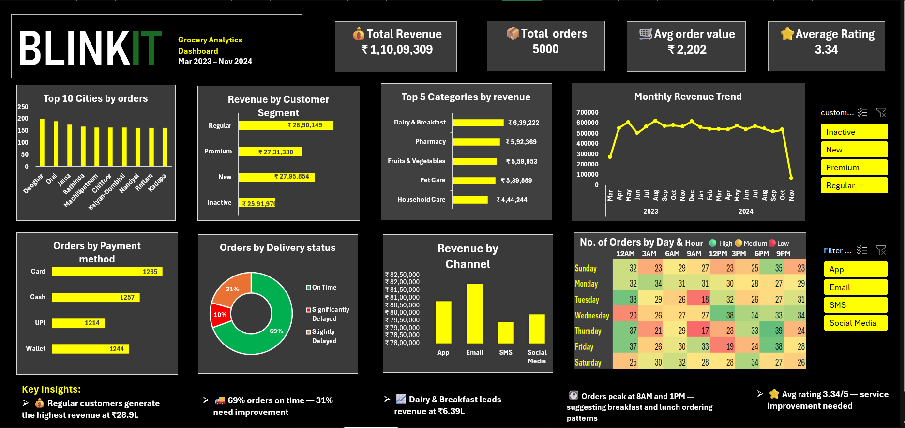

# 🛒 Blinkit Grocery Analytics Dashboard

## 📌 Project Overview

This project is an interactive Microsoft Excel dashboard developed to analyze Blinkit's grocery order data and transform raw transactional data into meaningful business insights.

The dashboard helps stakeholders monitor revenue, customer behavior, delivery performance, product category performance, ordering trends, and overall business KPIs through an interactive reporting experience.

---

## 🎯 Business Objective

The objective of this project is to move beyond simple reporting by creating an interactive dashboard that supports data-driven decision-making through clear and actionable insights.

---

## 🛠️ Tools & Technologies

- Microsoft Excel
- Power Pivot
- Pivot Tables
- Pivot Charts
- DAX Relationships
- VLOOKUP
- Conditional Formatting
- Interactive Slicers

---

## 📂 Dataset

- 5,000 Orders
- 6 Related Tables
- Customer Data
- Product Data
- Order Data
- Delivery Data
- Customer Feedback Data
- Order Items Data

---

## 📊 Dashboard Preview

---

## 📈 Key Performance Indicators

- 💰 Total Revenue
- 📦 Total Orders
- 🛒 Average Order Value
- ⭐ Average Customer Rating

---

## 💡 Key Business Insights

- Regular customers generated the highest revenue despite new customers placing more orders.
- Dairy & Breakfast was the highest revenue-generating category.
- Most orders were delivered on time, while delayed deliveries highlighted operational improvement opportunities.
- Customer ratings indicate room for service quality improvement.
- Order demand peaks around breakfast and lunch hours.

---

## ⚡ Challenges Faced

- Built a Power Pivot Data Model connecting six related tables.
- Connected multiple datasets using relationships.
- Built an Orders Heatmap using Conditional Formatting.
- Created interactive slicers controlling multiple dashboard visuals.

---

## 📚 Skills Demonstrated

- Data Cleaning
- Data Modeling
- Dashboard Design
- Business Analytics
- KPI Reporting
- Excel Visualization
- Data Storytelling

---

## 🚀 Key Learning

This project strengthened my understanding of transforming raw business data into interactive dashboards that support better business decisions. It also improved my skills in data modeling, visualization, and communicating analytical insights effectively.
